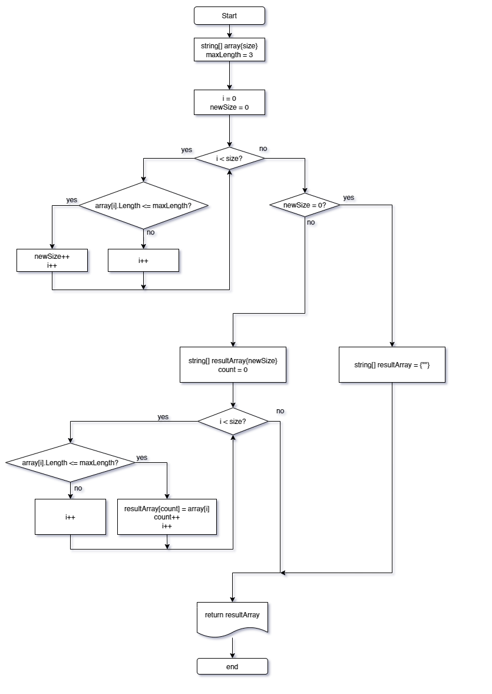

## Программа для формирования из имеющегося строкового массива нового массива строк, длина которых меньше, либо равна 3 символам.

Основная работа организована в функции **StringFilter**, которая на вход принимает исходный строковый массив и на выход формирует новый массив с требуемыми строками.
    
    Исходный массив в данном случае задается на старте выполнения алгоритма.

### Функция **StringFilter**
На начальном этапе инициализируются две локальные целочисленные переменные:
1. _size_ - для определения размера результирующего массива.
2. _count_ - для индексирования результирующего массива.

Далее, в первом цикле производится подсчёт всех строк исходного массива, длина которых меньше либо равна 3 символам. Результат сохраняется в ***size***.

Затем создается новый строковый массив размером ***size***, в который, при помощи следующего цикла, из исходного массива поэлементно копируются строки, удовлетворяющие условию.

    _рис. 1. Алгоритм работы функции._